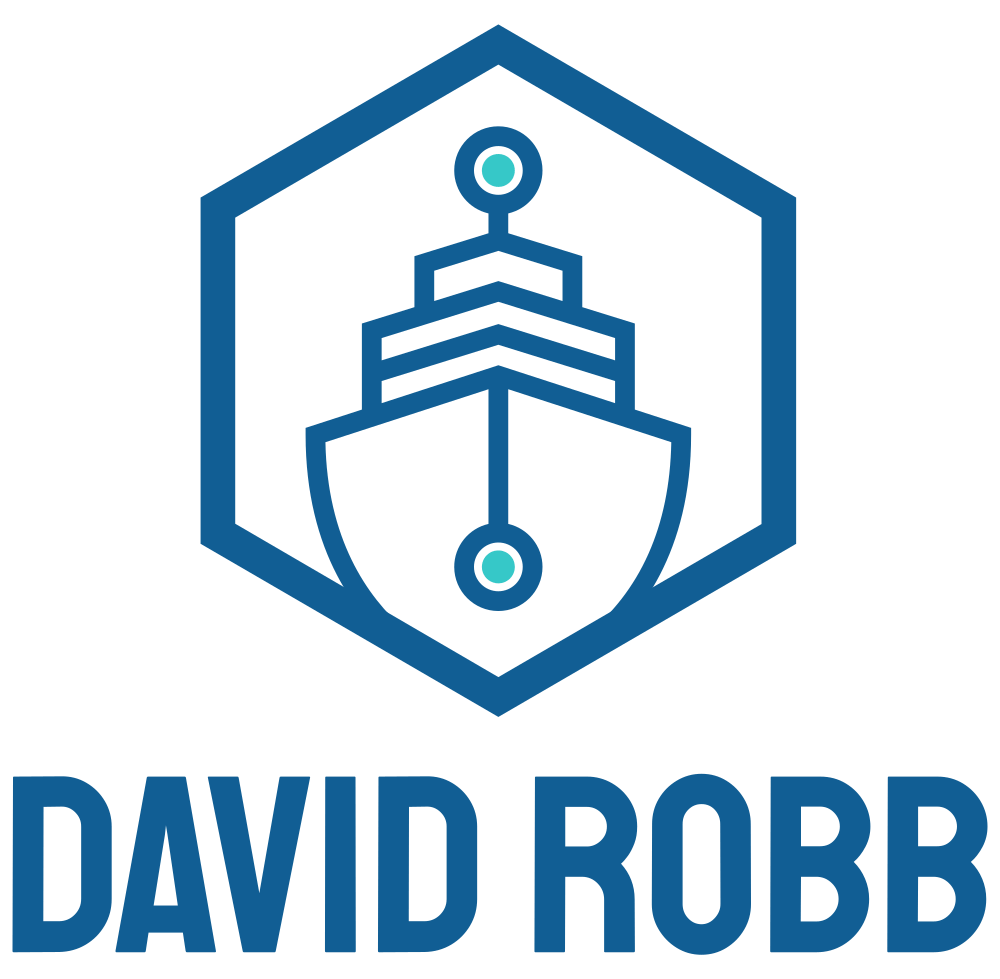

<div id="top"></div>
<!--
*** Thanks for checking out the Best-README-Template. If you have a suggestion
*** that would make this better, please fork the repo and create a pull request
*** or simply open an issue with the tag "enhancement".
*** Don't forget to give the project a star!
*** Thanks again! Now go create something AMAZING! :D
-->

<!-- PROJECT SHIELDS -->
<!--
*** I'm using markdown "reference style" links for readability.
*** Reference links are enclosed in brackets [ ] instead of parentheses ( ).
*** See the bottom of this document for the declaration of the reference variables
*** for contributors-url, forks-url, etc. This is an optional, concise syntax you may use.
*** https://www.markdownguide.org/basic-syntax/#reference-style-links
-->
[![Contributors][contributors-shield]][contributors-url]
[![Forks][forks-shield]][forks-url]
[![Stargazers][stars-shield]][stars-url]
[![Issues][issues-shield]][issues-url]
[![MIT License][license-shield]][license-url]
[![LinkedIn][linkedin-shield]][linkedin-url]

<!-- PROJECT LOGO -->
<br />
<div align="center">
  <a href="https://github.com/drobb2020/excession_blog">
    
  </a>

<h3 align="center">Excession Development Blog Project</h3>

  <p align="center">
    This is an updated version of my internal blog application so I can document the tools and features of Django that I am learning.
    <br />
    <a href="https://github.com/drobb2020/excession_blog"><strong>Explore the docs »</strong></a>
    <br />
    <br />
    <a href="https://github.com/drobb2020/excession_blog">View Demo</a>
    ·
    <a href="https://github.com/drobb2020/excession_blog/issues">Report Bug</a>
    ·
    <a href="https://github.com/drobb2020/excession_blog/issues">Request Feature</a>
  </p>
</div>

<!-- TABLE OF CONTENTS -->
<details>
  <summary>Table of Contents</summary>
  <ol>
    <li>
      <a href="#about-the-project">About The Project</a>
      <ul>
        <li><a href="#built-with">Built With</a></li>
      </ul>
    </li>
    <li>
      <a href="#getting-started">Getting Started</a>
      <ul>
        <li><a href="#prerequisites">Prerequisites</a></li>
        <li><a href="#installation">Installation</a></li>
      </ul>
    </li>
    <li><a href="#usage">Usage</a></li>
    <li><a href="#deployment">Deployment</a></li>
    <li><a href="#roadmap">Roadmap</a></li>
    <li><a href="#contributing">Contributing</a></li>
    <li><a href="#license">License</a></li>
    <li><a href="#contact">Contact</a></li>
    <li><a href="#acknowledgments">Acknowledgments</a></li>
  </ol>
</details>

<!-- ABOUT THE PROJECT -->
## About The Project

[![Excession Blog screen shot][product-screenshot]](https://example.com)

Write something meaningful!

<p align="right">(<a href="#top">back to top</a>)</p>

### Built With

* [Django](https://www.djangoproject.com/)
* [Bootstrap](https://getbootstrap.com/) (Bootswatch theme - Slate)
* [Heroicons](https://heroicons.com/)
* [JQuery](https://jquery.com/)
* [HTMX](https://htmx.org/)
* [Alpine.js](https://alpinejs.dev/)

<p align="right">(<a href="#top">back to top</a>)</p>

<!-- GETTING STARTED -->
## Getting Started

You're welcome to clone or download this repository and try it out for yourself. However, it's more fun to try this project for yourself from scratch. The tools that I use are:

* Python 3.11.9
* Django 5.1 (The project was actually started on Django 5.0.6)
* Visual Studio Code 1.92.2

Once you have a development environment up you can begin to code this project. For a complete step by step guide on the project setup see [PROJECT_SETUP.md](./PROJECT_SETUP.md). A PDF version of this document is also available.

### Prerequisites

To start a django project at the least you need Python installed on your local workstation. Please visit [python.org](https://python.org) and follow the download link to download the latest version for your operating system. While this project was built on Python 3.11.9 it should run fine with Python 3.12.x.
You should also create yourself a folder structure to contain your project and other supporting files. I developed this project on a Mac Mini and my full folder path is /Users/davidrobb/projects/David_Robb/excession_blog/. You should create a similar path for your own projects.
Next you should pick a code editor that meets your needs. I use [Visual Studio Code](https://code.visualstudio.com/), but I have also used [PyCharm](https://www.jetbrains.com/pycharm/), [Atom](https://atom-editor.cc/), and [Sublime Text](https://www.sublimetext.com/).

After all of that the next step is to create a virtual environment

* Python Virtual Environment (venv)

  ```sh
  cd /Users/davidrobb/projects/David_Robb/excession_blog/
  python -m venv venv
  source venv/bin/activate (Windows /venv/Scripts/activate)
  ```

  Please see my [SUPPORTING_FILES.md](./SUPPORTING_FILES.md) that I add to each project to make things run smoother.

### Installation

The first package I typically install is pip-tools.

```sh
pip install pip-tools
```

But you can simply install the minimum necessary packages using the following command:

```sh
pip install django django-extensions environs[django] black ruff
```

You should then run:

```sh
pip freeze > requirements.txt
```

From this point forward you can start to create your project with the following command:

```sh
django-admin startproject blog_project [.]
```

The trailing period is optional. If you do not add it then you will end up with two folders named blog_project. The top folder will hold the full django project and a subfolder will hold the project settings file and other supporting files. If you use the period only the subfolder will be created.

From this point forward you can now use the ```python manage.py``` script to add applications to the project. I typically start with accounts since I like to create a custom user model that I use with django-allauth.

<p align="right">(<a href="#top">back to top</a>)</p>

<!-- USAGE EXAMPLES -->
## Usage

This is primarily a blog application with a few extra special features. Namely there is a ticketing system built into the project in case users have any problems with the application.

_For more examples, please refer to the [Documentation](https://github.com/drobb2020/excessio_blog/wiki)_

<p align="right">(<a href="#top">back to top</a>)</p>

## Deployment

Please read the [DEPLOYMENT_NOTES.md](./DEPLOYMENT_NOTES.md) file on how to deploy a django app using nginx, gunicorn and postgresql on an Ubuntu server.

<p align="right">(<a href="#top">back to top</a>)</p>

<!-- ROADMAP -->
## Roadmap

- [X] Add popup messages to all actions
- [ ] Complete the setup of the monthly newsletter
- [ ] Add celery and celery-beat for sending newsletters
- [ ] Add HTMX pagination to the post_list view

See the [open issues](https://github.com/drobb2020/excession_blog/issues) for a full list of proposed features (and known issues).

<p align="right">(<a href="#top">back to top</a>)</p>

<!-- CONTRIBUTING -->
## Contributing

Contributions are what make the open source community such an amazing place to learn, inspire, and create. Any contributions you make are **greatly appreciated**.

If you have a suggestion that would make this better, please fork the repo and create a pull request. You can also simply open an issue with the tag "enhancement".
Don't forget to give the project a star! Thanks again!

1. Fork the Project
2. Create your Feature Branch (`git checkout -b feature/AmazingFeature`)
3. Commit your Changes (`git commit -m 'Add some AmazingFeature'`)
4. Push to the Branch (`git push origin feature/AmazingFeature`)
5. Open a Pull Request

<p align="right">(<a href="#top">back to top</a>)</p>

<!-- LICENSE -->
## License

Distributed under the MIT License. See `LICENSE.txt` for more information.

<p align="right">(<a href="#top">back to top</a>)</p>

<!-- CONTACT -->
## Contact

David Robb - drobb2011@gmail.com

Project Link: [https://github.com/drobb2020/excession_blog](https://github.com/drobb2020/excession_blog)

<p align="right">(<a href="#top">back to top</a>)</p>

<!-- ACKNOWLEDGMENTS -->
## Acknowledgments

* [Bugbytes](https://www.youtube.com/@bugbytes3923)
* [John Elder - Codemy.com](https://www.youtube.com/@Codemycom)
* [Corey Schafer](https://www.youtube.com/@coreyms)

<p align="right">(<a href="#top">back to top</a>)</p>

<!-- MARKDOWN LINKS & IMAGES -->
<!-- https://www.markdownguide.org/basic-syntax/#reference-style-links -->
[contributors-shield]: https://img.shields.io/github/contributors/drobb2020/excession_blog.svg?style=for-the-badge
[contributors-url]: https://github.com/drobb2020/excession_blog/graphs/contributors
[forks-shield]: https://img.shields.io/github/forks/drobb2020/excession_blog.svg?style=for-the-badge
[forks-url]: https://github.com/drobb2020/excession_blog/network/members
[stars-shield]: https://img.shields.io/github/stars/drobb2020/excession_blog.svg?style=for-the-badge
[stars-url]: https://github.com/drobb2020/excession_blog/stargazers
[issues-shield]: https://img.shields.io/github/issues/drobb2020/excession_blog.svg?style=for-the-badge
[issues-url]: https://github.com/drobb2020/excession_blog/issues
[license-shield]: https://img.shields.io/github/license/drobb2020/excession_blog.svg?style=for-the-badge
[license-url]: https://github.com/drobb2020/excession_blog/blob/master/LICENSE.txt
[linkedin-shield]: https://img.shields.io/badge/-LinkedIn-black.svg?style=for-the-badge&logo=linkedin&colorB=555
[linkedin-url]: https://linkedin.com/in/linkedin_username
[product-screenshot]: ./static/images/screenshot.png
